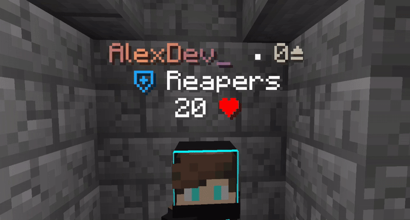

# UnlimitedNameTags — Wiki

> Fancy stacked name tags on Paper: **plain text**, **items**, and **blocks** above the head; works with PlaceholderAPI; optional movement and colour effects.

This wiki goes with **[UnlimitedNameTags](https://github.com/alexdev03/UnlimitedNameTags)** on GitHub.

| | |
|:--|:--|
| **Server** | Paper **1.20.1+** (Spigot 1.20.2+ works; Paper is recommended) |
| **Required add-on** | [PacketEvents](https://modrinth.com/plugin/packetevents) — install it like any other plugin |
| **Main settings** | `plugins/UnlimitedNameTags/settings.yml` (created when the plugin first runs) |
| **Optional extra file** | `advanced.yml` — only if you need to nudge nametag height for certain helmets (not created automatically) |

---

## Where to start

| Page | What you'll find |
|------|------------------|
| [Configuration](configuration.md) | Main settings file explained step by step |
| [Display groups](features/display-groups.md) | Stacking multiple lines, conditions, text vs item vs block |
| [Performance](performance.md) | If the server feels heavy — what to turn down or slow |
| [FAQ](faq.md) | Common “why doesn’t this work?” answers |
| [Commands & permissions](commands-permissions.md) | `/unt` and who can use what |
| [Integrations](integrations/integrations.md) | Other plugins (Nexo, Geyser, PlaceholderAPI, …) |

### Feature guides

- [Animations](features/animations.md) — moving or colour-cycling text and tags
- [Billboard](features/billboards.md) — how the tag turns toward the camera
- [Placeholder replacements](features/placeholders-replacements.md) — turn raw placeholder text into nicer labels
- [Show while looking](features/show-while-looking.md) — only show the tag when someone looks at the player
- [Advanced (`advanced.yml`)](features/advanced-yml.md) — fine-tune helmet height by hand
- [Performance](performance.md) — optional tuning when many players are online

---

## Supported versions

**Server:** Paper 1.20.1+; Spigot 1.20.2+ (Paper is still preferred).

**Java players:** custom tags need **Minecraft Java 1.19.4 or newer**. Older game versions simply cannot show this kind of nametag — that is a game limit, not something you fix in config alone. **ViaVersion does not** make ancient clients magically support these tags.

**Bedrock (Geyser):** works partially; colours, backgrounds, and multi-line may not look the same as on Java.

---

## Support

[Discord](https://discord.gg/W4Fu8fqCKs) — for help after purchase, open a ticket with a verified license where required.
