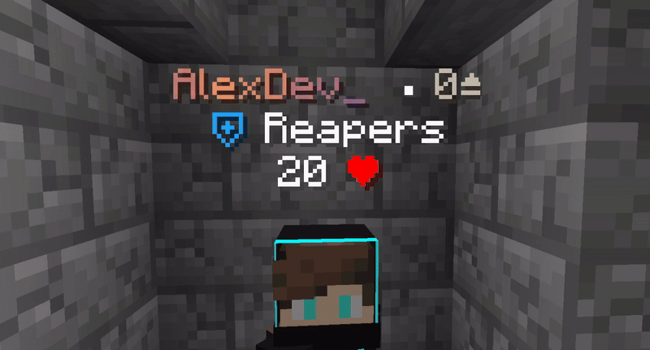

# 👑 UnlimitedNameTags — Wiki

   
  A premium solution for advanced stacked name tags (featuring plain text, items, and blocks) above player heads on Paper servers.

  
  

> [!NOTE]
> This is the documentation for **UnlimitedNameTags v2.x (current)**. If you are using the legacy
> version 1.x, please refer to the [v1 Wiki](v1/README.md).

This wiki is the official documentation for
**[UnlimitedNameTags](https://github.com/alexdev03/UnlimitedNameTags)** on GitHub.

| Requirement | Details |
| :--- | :--- |
| **Server Software** | **Paper 1.21.4+** (Paper or its forks are highly recommended) |
| **Required Dependency** | **[PacketEvents](https://modrinth.com/plugin/packetevents)** (must be installed as a standard plugin) |
| **Main Configuration** | `plugins/UnlimitedNameTags/settings.yml` (automatically generated on first run) |
| **Advanced Tweaks** | `plugins/UnlimitedNameTags/advanced.yml` (optional configuration file for helmet height adjustment) |

---

## 📂 Documentation Directory

Our documentation is structured according to the **Divio System** to help you find the exact
information you need, whether you are installing the plugin for the first time or writing custom
integrations.

### 🏁 Tutorials & Getting Started
- **[Getting Started](getting-started.md)**: Installation process, requirements, and basic setup.
- **[Migration Guide](migration.md)**: Upgrading from legacy configuration structures (v1.x) to
  v2.x.

### 🛠️ How-To Guides
- **[Display Groups](features/display-groups.md)**: Learn how to stack lines, adjust layouts, and
  use custom text, items, or blocks.
- **[Animations](features/animations.md)**: Add physical movement, colors, and dynamic gradients to
  name tags.
- **[Show While Looking](features/show-while-looking.md)**: Display name tags dynamically based on
  viewer crosshair target.
- **[Advanced Configuration](features/advanced-yml.md)**: Fine-tune custom name tag height offsets
  using `advanced.yml`.
- **[Placeholder Replacements](features/placeholders-replacements.md)**: Clean and map raw
  PlaceholderAPI (PAPI) outputs.

### 📚 Reference Manuals
- **[Configuration Reference](configuration.md)**: A detailed breakdown of every main `settings.yml`
  option.
- **[Commands & Permissions](commands-permissions.md)**: Full list of `/unt` command usage and
  permission nodes.
- **[Developer API](api.md)**: Java API (Application Programming Interface) integration
  documentation for custom developers.
- **[Integrations](integrations/integrations.md)**: External plugin compatibility details (Nexo,
  Oraxen, Geyser, etc.).

### 💡 Explanations & Troubleshooting
- **[Performance Tuning](performance.md)**: Best practices for running the plugin on active or
  large servers.
- **[FAQ](faq.md)**: Answers to common setup questions and troubleshooting steps.

---

## 📋 Compatibility & Requirements

### Server Platform
- **Paper 1.21.4+** is required. Paper provides optimized packet handling and API support necessary
  for rendering custom displays.

### Java Clients
> [!WARNING]
> Custom displays require **Minecraft Java 1.19.4 or newer**. Older clients (pre-1.19.4) do not
> support the game engine rendering features required by this plugin. Using protocol support
> plugins like **ViaVersion** will not bypass this native client-side rendering limitation.

### Bedrock Edition (Geyser)
- **Geyser/Bedrock** players are partially supported. However, visual features (e.g., custom
  colors, custom backgrounds, multi-line alignments) may render differently compared to Java Edition
  clients due to Bedrock rendering engine limitations.

---

## 🚀 Support

Need assistance? Join the community on our **[Discord Server](https://discord.gg/W4Fu8fqCKs)**. 
- To receive support, please open a ticket in the designated channel and verify your license when
  prompted.
