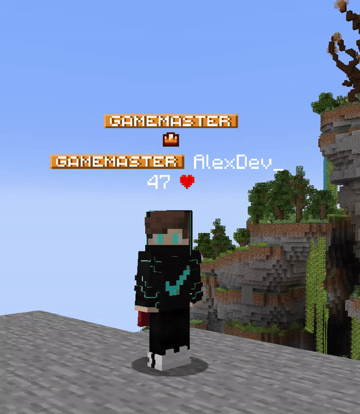

# Integrations

UnlimitedNameTags talks to several popular plugins when they are installed. This page is a **practical** overview — not every edge case.

---

## Nexo & Oraxen

**Nexo** and **Oraxen** can **raise or lower** the nametag when someone wears a tall custom hat, so the text does not clip into the model.

### Nexo

With Nexo helmets (or items from merged resource packs), the tag follows model height.

### Oraxen

Same idea for **Oraxen** hats.

You can **add or tweak** behaviour with [`advanced.yml`](../features/advanced-yml.md) — hand-written rules can win over automatic ones in some cases (see that page).

---

## ItemsAdder

Some releases build **without** automatic ItemsAdder height. Check **your jar’s** release notes — if auto support is off, use [`advanced.yml`](../features/advanced-yml.md) and match **`customModelData`**, **`equippableModel`**, or **`material`** yourself.

---

## Hats / cosmetics (HMCCosmetics, etc.)

**HMCCosmetics** is supported for height when a compatible source is there (e.g. CreativeHook / Nexo).

**CosmeticsCore** has no direct hook — it only works if the worn helmet is still a normal item the other systems can recognise.

---

## ViaVersion

With **ViaVersion**, the server can tell whether a client **can** show these custom tags. It does **not** make **Java below 1.19.4** fully supported for text-display nametags. See [Supported versions](../README.md#supported-versions).

---

## LibsDisguises

Nametags can be hidden while someone is disguised as another entity.

---

## PlaceholderAPI

Nametag lines use **PlaceholderAPI** as usual. Turn **`enableRelationalPlaceholders`** **on** only if you need placeholders that **depend on who is looking** (viewer + target).

### Built-in `%unt_<param>%` expansion

| Placeholder | Purpose |
|-------------|---------|
| `%unt_phase-mm%` | MiniMessage-style animation phase |
| `%unt_phase-md%` | MineDown phase |
| `%unt_phase-mm-g%` | MiniMessage gradient phase |
| `%unt_-phase-mm%` | Negative phase (MiniMessage) |
| `%unt_-phase-md%` | Negative phase (MineDown) |

There is **no** `%unt_-phase-mm-g%` — put **`#-phase-mm-g#`** in the line text instead (see [Animations](../features/animations.md)).

---

## MiniPlaceholders

Works. Prefer **`MINIMESSAGE`** or **`UNIVERSAL`** for formatting. If text looks “stuck,” try turning **`componentCaching`** **off** in [Performance](../performance.md).

---

## TypeWriter

Nametags can be hidden during cinematic-style scenes.

---

## Floodgate

Helps tell **Bedrock** players from **Java** where the plugin needs to behave differently.

---

## FeatherServerAPI

When present, the plugin can **turn off** Feather’s client nametag on supported Java clients so it does not fight with the server-side tag.

---

## Bedrock (Geyser)

**Geyser** lets Bedrock players see nametags, but the result is **not** pixel-identical to Java — backgrounds, shadows, and multi-line layouts may differ. See [Supported versions / Bedrock](../README.md#supported-versions).
