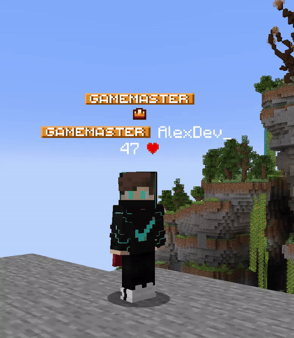

# Integrations

**UnlimitedNameTags** integrates with several popular plugins to provide automatic features (such as height offsets for custom headwear) and custom visual effects.

---

## Nexo & Oraxen (Custom Helmets)

Both **Nexo** and **Oraxen** automatically adjust player name tag heights when players equip custom helmets or tall hats, preventing the name tag text from clipping into the custom models.

### Nexo Offset Rendering
With Nexo custom helmets (or custom items utilizing merged resource packs), the tag automatically tracks model height offsets.

UnlimitedNameTags reads modern item-model/equippable-model data for Nexo height detection and falls back to resource-pack JSON model data when the direct Creative model lookup is not enough.

### Oraxen
Similarly, Oraxen custom hats automatically offset name tag rendering heights.

> [!TIP]
> You can override or adjust these automatic height rules manually by writing custom rule sets in `advanced.yml`. (See the [advanced.yml Guide](../features/advanced-yml.md)).

---

## ItemsAdder

**ItemsAdder** custom items and helmets are automatically detected and integrated. When a player equips a custom hat or helmet created via ItemsAdder, the plugin registers a height offset hook to dynamically adjust the player's name tag height.

This ensures the custom name tag is raised above the custom helmet model to prevent visual clipping.

### Integration Details
* **Automatic Detection**: The plugin registers the ItemsAdder hook automatically when the ItemsAdder plugin is loaded.
* **Model Lookup**: The hook queries the ItemsAdder API (`CustomStack`) to identify the custom item stack, retrieve its namespace and model path, and extract the corresponding height offset from the resource pack.
* **JSON Fallback**: If the Creative model reader cannot resolve the height directly, the hook can inspect modern item-model/equippable-model JSON and legacy custom-model-data overrides from `ItemsAdder/output/generated.zip`.
* **Resilient Pack Reading**: Invalid or non-object `.mcmeta` sidecar files in generated packs are skipped instead of breaking the whole pack load.
* **Fallback Rules**: If you need to manually override or fine-tune specific ItemsAdder helmet heights, you can still define custom rules in `advanced.yml`. (See the [advanced.yml Guide](../features/advanced-yml.md)).

---

## Cosmetics & Accessories (HMCCosmetics, etc.)

- **HMCCosmetics**: Helmet-slot cosmetics are supported for height offsets. The plugin reads the
  player's active per-user virtual cosmetic item from HMCCosmetics, so packet/virtual hats can be matched by
  Nexo/CreativeHook data or by custom rules in `advanced.yml`.
- **CosmeticsCore**: Direct integration is not supported. Custom helmets must be recognized as
  standard items by other supported integration systems for offsets to apply.

---

## ViaVersion

> [!WARNING]
> While **ViaVersion** allows older client versions to connect to the server and helps the plugin detect client capability profiles, it **does not** enable custom display entity rendering on Java clients older than **1.19.4**. **ViaBackwards is not supported.** (See [Limitations](../limitations.md)).

---

## LibsDisguises

- The plugin automatically hides custom name tags when players are disguised as other entity
  types.

---

## PlaceholderAPI

Name tags fully support standard **PlaceholderAPI** variables.

> [!IMPORTANT]
> To use viewer-dependent placeholders (such as `%rel_...%` or `%relational_...%`), you must enable `performance.enableRelationalPlaceholders: true` in `settings.yml`. (See the [Performance Tuning Guide](../performance.md)).

### Built-in `%unt_` Placeholder Expansion

| Placeholder | Description |
| :--- | :--- |
| **`%unt_phase-mm%`** | MiniMessage-style color cycling animation phase. |
| **`%unt_phase-md%`** | MineDown color cycling animation phase. |
| **`%unt_phase-mm-g%`** | MiniMessage gradient cycling animation phase. |
| **`%unt_-phase-mm%`** | Reverse MiniMessage color cycling animation phase. |
| **`%unt_-phase-md%`** | Reverse MineDown color cycling animation phase. |

> [!NOTE]
> There is no `%unt_-phase-mm-g%` placeholder. To use reverse gradient cycles, write the token **`#-phase-mm-g#`** directly within your text lines. (See the [Animations Guide](../features/animations.md)).

---

## MiniPlaceholders

- **MiniPlaceholders** is fully supported.
- Set `behavior.format` to `MINIMESSAGE` or `UNIVERSAL` for optimal formatting.
- If text components appear static or fail to update, try disabling
  `performance.componentCaching` in `settings.yml`. (See the
  [Performance Tuning Guide](../performance.md)).

---

## TypeWriter

- Custom name tags are automatically hidden during TypeWriter cinematic sequences.

---

## Floodgate

- Integrates with **Floodgate** to differentiate Bedrock Edition players from Java Edition
  players, adjusting name tag packaging logic where needed.

---

## FeatherServerAPI

- When present, the plugin disables Feather's client-side name tags on supported Java clients
  to prevent rendering conflicts.

---

## Bedrock Edition (Geyser)

> [!NOTE]
> Name tags render on Bedrock Edition clients connected via **Geyser**, but support is only partial. Rendering elements (such as background plates, drop-shadows, and multi-line stacks) may not appear identical to Java Edition clients due to Bedrock rendering limitations.

---

## Unsupported integrations and workarounds

**Simple Voice Chat** is not natively supported. You can use
[VoiceChatPlaceholders](https://hangar.papermc.io/Tommm/VoiceChatPlaceholders) as an optional
workaround with PlaceholderAPI lines in your name tags. Placeholder indicators will not match Simple
Voice Chat's native icons; matching visuals requires a custom resource pack. See
[Limitations — Simple Voice Chat](../limitations.md#simple-voice-chat).

For other known constraints (NPC plugins, ViaBackwards, display entity collisions, and more), see
[Limitations](../limitations.md).
